# Implementation plan — Nonogram Generator

_Generated by `forge:kanban decompose` on 2026-08-27 from
`meta/architecture/handoff.md` (3 increments) → 17 cards, 12.25d, 11 waves.
Updated 2026-08-30: Increment 4 (local web UI) → CARD-019..CARD-021, +2d, waves 12–14.
Updated 2026-08-31: Increment 5 (rectangular grids, print-legible cells) →
CARD-023..CARD-028, +4.25d, waves 16–19.
CARD-018 and CARD-022 are unscheduled follow-ups and are not on this chart; wave 15 is
left free because the live board renumbered increment 4 around CARD-022's insertion._

Waves are the topological levels of the `Depends on` graph. Increment boundaries are
respected: no Increment 2 card starts before Increment 1's terminal cards
(CARD-006, CARD-007) are merged, and no Increment 3 card before Increment 2's
(CARD-014). Within a wave, ordering is **uncertainty-first** — `Complexity:
architectural` cards lead, then P1, then P2/P3.

Checkpoints per wave: `meta/kanban/waves.yml`. Board: `meta/kanban/board.md`.

```mermaid
gantt
  title Nonogram Generator — implementation plan
  dateFormat X
  axisFormat Day %j

  section Wave 1 - skeleton
    CARD-001 P1 Package scaffolding and CLI entry point  :crit, card1, 0, 12h

  section Wave 2
    CARD-002 P1 Clue derivation via RLE                  :crit, card2, after card1, 12h
    CARD-003 P1 Random grid sourcing                     :crit, card3, after card1, 12h

  section Wave 3
    CARD-004 P1 Solver with fail-fast uniqueness         :crit, card4, after card2, 1d

  section Wave 4
    CARD-005 P1 Orchestrator and regenerate loop         :crit, card5, after card3 card4, 1d

  section Wave 5 - increment 1 checkpoint
    CARD-006 P1 Cooperative deadline and SolverTimeout   :crit, card6, after card4 card5, 12h
    CARD-007 P1 JSON export and readiness gate           :crit, card7, after card5, 12h

  section Wave 6
    CARD-009 P1 Difficulty scoring formula               :crit, card9, after card4 card6 card7, 1d
    CARD-012 P1 PNG and SVG export renderers             :crit, card12, after card6 card7, 1d
    CARD-013 P1 CSV export and round-trip fidelity       :crit, card13, after card6 card7, 12h
    CARD-008 P2 Built-in image library sourcing          :card8, after card3 card6 card7, 12h
    CARD-011 P2 Puzzle naming                            :card11, after card5 card6 card7, 12h

  section Wave 7
    CARD-010 P1 Difficulty tier selection and resample   :crit, card10, after card9 card11, 1d

  section Wave 8 - increment 2 checkpoint
    CARD-014 P2 Two-page PDF export with answer key      :card14, after card10 card12 card13, 1d

  section Wave 9
    CARD-015 P2 Uploaded-image conversion and dithering  :card15, after card8 card14, 1d

  section Wave 10
    CARD-016 P2 Bounded pixel-nudge recovery loop        :card16, after card15, 1d

  section Wave 11 - increment 3 checkpoint
    CARD-017 P3 Nudge-count reporting in CLI output      :card17, after card16, 6h

  section Wave 12 - increment 4
    CARD-019 P1 Web server skeleton and serve subcommand :crit, card19, after card17, 12h

  section Wave 13
    CARD-020 P1 Web UI generation submission             :crit, card20, after card19, 1d

  section Wave 14 - increment 4 checkpoint
    CARD-021 P2 Image upload via multipart parsing       :card21, after card20, 12h

  section Wave 16 - increment 5
    CARD-023 P1 Grid range narrows to 10..30             :crit, card23, after card21, 12h
    CARD-024 P1 Export metadata w/h at schema v2         :crit, card24, after card21, 1d
    CARD-025 P2 Print cell size min(cap, page fit)       :card25, after card21, 12h

  section Wave 17
    CARD-026 P1 Image fit to grid shape + 2x refusal     :crit, card26, after card23, 1d

  section Wave 18
    CARD-027 P1 Grid extent as a width/height pair       :crit, card27, after card23 card24 card26, 1d

  section Wave 19 - increments 5 and 6
    CARD-028 P2 Web form accepts the NxM extent token    :card28, after card20 card27, 6h
    CARD-030 P1 Trim to ink box + guard moves onto it    :crit, card30, after card27, 1d
    CARD-031 P2 Image mode names from the file stem      :card31, after card27, 6h
    CARD-032 P2 Unicode TTF as package data (PDF header) :card32, 0, 12h
```

## Critical path

`CARD-001 → CARD-002 → CARD-004 → CARD-005 → CARD-006 → CARD-009 → CARD-010 →
CARD-014 → CARD-015 → CARD-016 → CARD-017 → CARD-019 → CARD-020 → CARD-021 →
CARD-023 → CARD-026 → CARD-027 → CARD-028` — 15.0d of the 18.5d total.

The chain is dominated by the solver: everything downstream of CARD-004 waits on the
question the handoff put first (is the hand-rolled solver actually correct?). That is
deliberate — the plan collapses the biggest uncertainty before the wide wave 6 fan-out.

Increment 4 extends the same chain rather than branching off it: the web UI is a second
adapter over the finished pipeline, so it has nothing to parallelize against. Its three
cards are strictly sequential (skeleton → submission → upload), which is why waves 12–14
each hold exactly one card.

Increment 5 finally branches. Three of its six cards depend on nothing inside the
increment and open wave 16 in parallel: the range narrowing (CON-011), the export
schema bump (ADR-0023) and the print cell-size fix (NFR-005) touch disjoint files.
The print card is the most independent of the three — it repairs a defect that exists
today (a 10x10 prints 30% too small) and has nothing to do with rectangles, because
`layout.py` already derives extent from the clue sets rather than from a size parameter.
The remaining three are a chain into the boundary-type change: the image crop
generalization (CARD-026) deliberately ships BEFORE the extent pair (CARD-027) so that
a non-square image request never passes through the anisotropic stretch ADR-0022/R3
forbids; the web adapter (CARD-028) follows the pair it consumes.

## Predicted overlaps (`run` will serialize these pairs)

| Wave | Pair | Shared path |
|------|------|-------------|
| 5 | CARD-006 ∩ CARD-007 | `src/nonogram/orchestrator.py` |
| 6 | CARD-008 ∩ CARD-011 | `src/nonogram/orchestrator.py`, `src/nonogram/cli.py` |
| 6 | CARD-008 ∩ CARD-012 | `src/nonogram/orchestrator.py` |
| 6 | CARD-011 ∩ CARD-012 | `src/nonogram/orchestrator.py` |
| 6 | CARD-012 ∩ CARD-013 | `src/nonogram/export/__init__.py` |
| 12–14 | _(none)_ | one card per wave — no pairs to serialize |
| 16 | _(none)_ | CARD-023 ∩ CARD-024 ∩ CARD-025 have disjoint footprints — sourcing+difficulty vs. the two structured formats vs. `layout.py` — so all three run concurrently |
| 17–18 | _(none)_ | one card per wave — no pairs to serialize |
| 19 | _(none)_ | CARD-028/030/031/032 have disjoint footprints — the web form vs. `sourcing/image.py` vs. `orchestrator.py` vs. `export/pdf.py` — so all four run concurrently. CARD-030's G-4/G-5 and CARD-031's G-5/G-6 state that split as a contract rather than leaving it to the conflict graph. CARD-032 has NO dependency at all (`Depends on: —`) and is drawn from day 0 rather than `after card27`: it is grouped into wave 19 because it belongs to increment 6, not because anything blocks it — it is runnable today |

`src/nonogram/orchestrator.py`, `src/nonogram/cli.py` and
`src/nonogram/export/__init__.py` are this project's structural hotspots — the
composition root and the two dispatch tables. Consider seeding them into
`conflict.hotspots` in `meta/kanban/config.yml`.
