# Implementation plan — Nonogram Generator

_Generated by `forge:kanban decompose` on 2026-08-27 from
`meta/architecture/handoff.md` (3 increments) → 17 cards, 12.25d, 11 waves._

Waves are the topological levels of the `Depends on` graph. Increment boundaries are
respected: no Increment 2 card starts before Increment 1's terminal cards
(CARD-006, CARD-007) are merged, and no Increment 3 card before Increment 2's
(CARD-014). Within a wave, ordering is **uncertainty-first** — `Complexity:
architectural` cards lead, then P1, then P2/P3.

Checkpoints per wave: `meta/kanban/waves.yml`. Board: `meta/kanban/board.md`.

```mermaid
gantt
  title Nonogram Generator — implementation plan
  dateFormat X
  axisFormat Day %j

  section Wave 1 - skeleton
    CARD-001 P1 Package scaffolding and CLI entry point  :crit, card1, 0, 12h

  section Wave 2
    CARD-002 P1 Clue derivation via RLE                  :crit, card2, after card1, 12h
    CARD-003 P1 Random grid sourcing                     :crit, card3, after card1, 12h

  section Wave 3
    CARD-004 P1 Solver with fail-fast uniqueness         :crit, card4, after card2, 1d

  section Wave 4
    CARD-005 P1 Orchestrator and regenerate loop         :crit, card5, after card3 card4, 1d

  section Wave 5 - increment 1 checkpoint
    CARD-006 P1 Cooperative deadline and SolverTimeout   :crit, card6, after card4 card5, 12h
    CARD-007 P1 JSON export and readiness gate           :crit, card7, after card5, 12h

  section Wave 6
    CARD-009 P1 Difficulty scoring formula               :crit, card9, after card4 card6 card7, 1d
    CARD-012 P1 PNG and SVG export renderers             :crit, card12, after card6 card7, 1d
    CARD-013 P1 CSV export and round-trip fidelity       :crit, card13, after card6 card7, 12h
    CARD-008 P2 Built-in image library sourcing          :card8, after card3 card6 card7, 12h
    CARD-011 P2 Puzzle naming                            :card11, after card5 card6 card7, 12h

  section Wave 7
    CARD-010 P1 Difficulty tier selection and resample   :crit, card10, after card9 card11, 1d

  section Wave 8 - increment 2 checkpoint
    CARD-014 P2 Two-page PDF export with answer key      :card14, after card10 card12 card13, 1d

  section Wave 9
    CARD-015 P2 Uploaded-image conversion and dithering  :card15, after card8 card14, 1d

  section Wave 10
    CARD-016 P2 Bounded pixel-nudge recovery loop        :card16, after card15, 1d

  section Wave 11 - increment 3 checkpoint
    CARD-017 P3 Nudge-count reporting in CLI output      :card17, after card16, 6h
```

## Critical path

`CARD-001 → CARD-002 → CARD-004 → CARD-005 → CARD-006 → CARD-009 → CARD-010 →
CARD-014 → CARD-015 → CARD-016 → CARD-017` — 9.5d of the 12.25d total.

The chain is dominated by the solver: everything downstream of CARD-004 waits on the
question the handoff put first (is the hand-rolled solver actually correct?). That is
deliberate — the plan collapses the biggest uncertainty before the wide wave 6 fan-out.

## Predicted overlaps (`run` will serialize these pairs)

| Wave | Pair | Shared path |
|------|------|-------------|
| 5 | CARD-006 ∩ CARD-007 | `src/nonogram/orchestrator.py` |
| 6 | CARD-008 ∩ CARD-011 | `src/nonogram/orchestrator.py`, `src/nonogram/cli.py` |
| 6 | CARD-008 ∩ CARD-012 | `src/nonogram/orchestrator.py` |
| 6 | CARD-011 ∩ CARD-012 | `src/nonogram/orchestrator.py` |
| 6 | CARD-012 ∩ CARD-013 | `src/nonogram/export/__init__.py` |

`src/nonogram/orchestrator.py`, `src/nonogram/cli.py` and
`src/nonogram/export/__init__.py` are this project's structural hotspots — the
composition root and the two dispatch tables. Consider seeding them into
`conflict.hotspots` in `meta/kanban/config.yml`.
