# Implementation plan — book generator (Increments 13–16)

_Generated by /forge:kanban decompose, 2026-09-22; updated by the 2026-09-22 (c) delta
(CARD-133, CARD-134 added — the answer key; CARD-128/CARD-129 now also wait on
CARD-134); updated again by the 2026-09-22 (d) delta (CARD-135 added in wave 20 — the
interior PDF without the cover; CARD-116 now also waits on it). Covers CARD-113..CARD-135 only.
CARD-001..CARD-112 are all `done`, and their waves (1–19) are not redrawn here. Book
waves are numbered 20–27 to match `waves.yml`. Within a wave, cards are ordered
uncertainty-first (`architectural` first). P1 cards carry `crit`._

```mermaid
gantt
  title Book generator — Increments 13–16
  dateFormat X
  axisFormat Day %j
  section Wave 20 (no deps)
    CARD-113 P1 Golden A4 tripwire            :crit, card113, 0, 12h
    CARD-135 P1 Interior PDF, cover separate  :crit, card135, 0, 1d
    CARD-119 P1 Plan domain buckets prefill   :crit, card119, 0, 1d
  section Wave 21
    CARD-114 P1 PageSpec in compute_layout    :crit, card114, after card113, 1d
    CARD-120 P1 Plan storage and Print setup  :crit, card120, after card119, 1d
  section Wave 22
    CARD-125 P2 Pair-aware layout call        :card125, after card114, 1d
    CARD-115 P1 Book PageSpec builder         :crit, card115, after card114, 12h
    CARD-122 P1 Longest-side selection tabs   :crit, card122, after card119 card120, 1d
    CARD-124 P1 Readiness gate                :crit, card124, after card119 card120, 12h
    CARD-133 P2 Answer tiles layout           :card133, after card114, 1d
  section Wave 23
    CARD-116 P1 Book PDF on its trim          :crit, card116, after card115 card135, 1d
    CARD-121 P1 Floor override at the store   :crit, card121, after card115 card120, 1d
  section Wave 24
    CARD-117 P1 Band and strokes              :crit, card117, after card116, 12h
    CARD-123 P1 Tile cell and finalise count  :crit, card123, after card121 card122, 12h
    CARD-126 P2 Level order in the book       :card126, after card121, 1d
  section Wave 25
    CARD-118 P1 Proof pages owner checkpoint  :crit, card118, after card117, 12h
    CARD-127 P2 Two-up pages in the PDF       :card127, after card117 card125, 1d
    CARD-130 P2 Step workflow re-entry        :card130, after card123 card124, 1d
    CARD-134 P2 Answer key pages in the PDF   :card134, after card117 card133, 1d
  section Wave 26
    CARD-128 P2 Level dividers in print       :card128, after card126 card127 card134, 12h
    CARD-131 P2 Published confirm no discard  :card131, after card126 card130, 1d
    CARD-132 P3 Books list plan stats         :card132, after card123 card124 card130, 12h
  section Wave 27
    CARD-129 P2 Finalise KDP gutter check     :card129, after card128 card123 card134, 12h
```

Increment checkpoints (see `waves.yml`):
- Increment 13 closes in wave 25 with CARD-118. It includes an **owner-confirmed**
  printed-proof checkpoint, which cannot be automated. Since the 2026-09-22 (d) delta it
  also checks the two-file export (interior from the guide page, cover separate —
  CARD-135 → CARD-116 → CARD-118).
- Increment 14 closes in wave 24 with CARD-123.
- Increment 16 closes in wave 26 with CARD-131/CARD-132.
- Increment 15 closes in wave 27 with CARD-129. It includes an owner's eye on rendered
  real-book pages, and since the 2026-09-22 (c) delta the answer-key page count
  (CARD-133 → CARD-134 → CARD-129: the finalise check needs the final page count).
