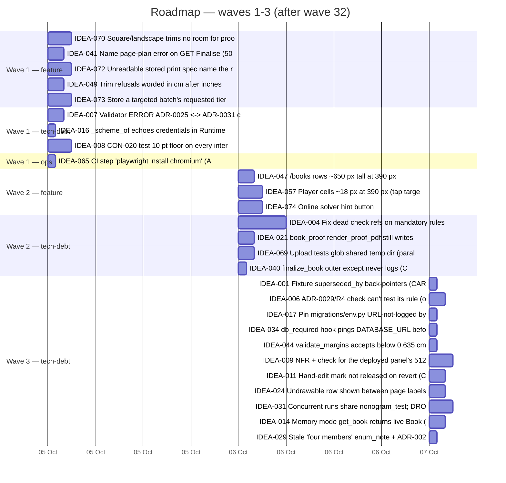

# Product Roadmap

_Generated: 2026-10-04 (re-plan after roadmap wave 1 shipped as kanban wave 32) · from meta/kanban/backlog-scored.yml_
_Stage: pre-launch (Book 1 not yet on KDP) · Methodology: WSJF for every non-ops category (owner choice 2026-10-04), FIFO for ops_

## Shipped since the last plan

Roadmap wave 1 → kanban wave 32 (tag `wave-32`): IDEA-066/067 → CARD-164 (main green, suite exit 0) · IDEA-046 → CARD-165 · IDEA-061/051/013 → CARD-166 · IDEA-071 → CARD-167 · IDEA-003/036 → CARD-168.

## Capacity Allocation

Wave budget **3 days** of card work. **Day calibration halved** after the wave-32 retro (cards merged in 0.1–0.3 d wall-clock; 0.24× in wave 32, ~0.45× over 17 cards): WSJF job size → days 1→0.125 · 2→0.25 · 3→0.375 · 5→0.75 · 8→1.25 · 13→2 · 20→3.

| Category | % | Per wave (days) | Note |
|---|--:|--:|---|
| feature | 60 | 1.80 |  |
| enabler | 15 | 0.45 | no ideas — rolls over to tech-debt |
| tech-debt | 5 | 0.15 | own 5% + roll-over |
| compliance | 15 | 0.45 | no ideas — rolls over to ops |
| ops | 5 | 0.15 |  |

⚑ Effort signal (cross-project, medium confidence): python-pro feature cards run 0.43× of estimate (7 cards) — WSJF job sizes on feature ideas may be high; consider lowering them at the next `score`.

⚑ 11 backlog items added after scoring (wave-32 leftovers: render.md owner fill-in, five hollow `images`-field tests, Finalise guide preview text, `?status=all`, the answer-key double-draw check, minors) are **not in this plan** — run `/forge:roadmap score` to score and slot them.

⚑ Owner decisions still inside the plan: IDEA-001 (fixture back-pointers), IDEA-002 (per-directory READMEs).

## Wave 1 (next iteration) — 2.50 d

### feature  (1.62 d)
1. **IDEA-070** Square/landscape trims: no room for proof foot note (WSJF 3.0) — 0.375 d
2. **IDEA-041** Name page-plan error on GET Finalise (500 handler) (WSJF 2.5) — 0.25 d
3. **IDEA-072** Unreadable stored print spec: name the remedy (WSJF 2.33) — 0.375 d
4. **IDEA-049** Trim refusals worded in cm after inches submission (WSJF 2.0) — 0.25 d
5. **IDEA-073** Store a targeted batch's requested tier (column+migration) (WSJF 1.67) — 0.375 d

### tech-debt  (0.75 d)
1. **IDEA-007** Validator ERROR: ADR-0025 <-> ADR-0031 circular supersession (WSJF 8.0) — 0.25 d
2. **IDEA-016** _scheme_of echoes credentials in RuntimeError (CARD-148) (WSJF 8.0) — 0.125 d
3. **IDEA-008** CON-020: test 10 pt floor on every interior face (WSJF 7.0) — 0.375 d

### ops  (0.12 d)
1. **IDEA-065** CI step 'playwright install chromium' (ADR-0038/R8) (FIFO) — 0.125 d

## Wave 2 — 2.38 d

### feature  (1.00 d)
1. **IDEA-047** /books rows ~650 px tall at 390 px (WSJF 1.5) — 0.25 d
2. **IDEA-057** Player cells ~18 px at 390 px (tap target) (WSJF 1.33) — 0.375 d
3. **IDEA-074** Online solver hint button (WSJF 1.33) — 0.375 d

### tech-debt  (1.38 d)
1. **IDEA-004** Fix dead check: refs on mandatory rules (CON-005, INV-*) (WSJF 6.6) — 0.75 d
2. **IDEA-021** book_proof.render_proof_pdf still writes DeviceRGB (WSJF 6.5) — 0.25 d
3. **IDEA-069** Upload tests glob shared temp dir (parallel interference) (WSJF 6.5) — 0.25 d
4. **IDEA-040** finalize_book outer except never logs (CARD-153 F-010) (WSJF 6.0) — 0.125 d

## Wave 3 — 2.38 d

### tech-debt  (2.38 d)
1. **IDEA-001** Fixture superseded_by back-pointers (CARD-147 F-007) (WSJF 5.0) — 0.125 d · ⚑ owner decision
2. **IDEA-006** ADR-0029/R4 check can't test its rule (overlap masks) (WSJF 5.0) — 0.25 d
3. **IDEA-017** Pin migrations/env.py URL-not-logged by assertion (CARD-148) (WSJF 5.0) — 0.125 d
4. **IDEA-034** db_required hook pings DATABASE_URL before _test guard (WSJF 5.0) — 0.125 d
5. **IDEA-044** validate_margins accepts below 0.635 cm minimum (WSJF 5.0) — 0.125 d
6. **IDEA-009** NFR + check for the deployed panel's 512 MB memory limit (WSJF 4.67) — 0.375 d
7. **IDEA-011** Hand-edit mark not released on revert (CARD-120 F-007) (WSJF 4.5) — 0.25 d
8. **IDEA-024** Undrawable row shown between page labels w/o marker (WSJF 4.5) — 0.25 d
9. **IDEA-031** Concurrent runs share nonogram_test; DROP SCHEMA races (WSJF 4.33) — 0.375 d
10. **IDEA-014** Memory mode get_book returns live Book (CARD-136) (WSJF 4.0) — 0.25 d
11. **IDEA-029** Stale 'four members' enum_note + ADR-0025 test narrative (WSJF 4.0) — 0.125 d

## Later waves (summary)

| Wave | Ideas | Days |
|--:|---|--:|
| 4 | IDEA-035, IDEA-038, IDEA-048, IDEA-054, IDEA-055, IDEA-062, IDEA-068, IDEA-010, IDEA-059, IDEA-012, IDEA-015 | 2.38 |
| 5 | IDEA-020, IDEA-023, IDEA-026, IDEA-027, IDEA-030, IDEA-037, IDEA-039, IDEA-043, IDEA-050, IDEA-053, IDEA-060, IDEA-064, IDEA-028, IDEA-022 | 2.38 |
| 6 | IDEA-058, IDEA-025, IDEA-032, IDEA-045, IDEA-052, IDEA-002, IDEA-019 | 2.38 |
| 7 | IDEA-075, IDEA-033, IDEA-042 | 3.50 |
| 8 | IDEA-056, IDEA-018 | 0.62 |

⚠ IDEA-075 (online solver, public phase) is ~3 d and overflows its bucket in wave 7; it sits there only because QR in Book 1 is undecided (score 0.8). If QR is confirmed it jumps to the top and needs a /forge:architect delta first — split it then.

## All ranked ideas

| Rank | Wave | ID | Idea | Cat | Score | Depends |
|--:|--:|---|---|---|--:|---|
| 1 | 1 | IDEA-070 | Square/landscape trims: no room for proof foot note | feature | 3.0 | — |
| 2 | 1 | IDEA-041 | Name page-plan error on GET Finalise (500 handler) | feature | 2.5 | — |
| 3 | 1 | IDEA-072 | Unreadable stored print spec: name the remedy | feature | 2.33 | — |
| 4 | 1 | IDEA-049 | Trim refusals worded in cm after inches submission | feature | 2.0 | — |
| 5 | 1 | IDEA-073 | Store a targeted batch's requested tier (column+migration) | feature | 1.67 | — |
| 6 | 1 | IDEA-007 | Validator ERROR: ADR-0025 <-> ADR-0031 circular supersession | tech-debt | 8.0 | — |
| 7 | 1 | IDEA-016 | _scheme_of echoes credentials in RuntimeError (CARD-148) | tech-debt | 8.0 | — |
| 8 | 1 | IDEA-008 | CON-020: test 10 pt floor on every interior face | tech-debt | 7.0 | — |
| 9 | 1 | IDEA-065 | CI step 'playwright install chromium' (ADR-0038/R8) | ops | FIFO | — |
| 10 | 2 | IDEA-047 | /books rows ~650 px tall at 390 px | feature | 1.5 | — |
| 11 | 2 | IDEA-057 | Player cells ~18 px at 390 px (tap target) | feature | 1.33 | — |
| 12 | 2 | IDEA-074 | Online solver hint button | feature | 1.33 | — |
| 13 | 2 | IDEA-004 | Fix dead check: refs on mandatory rules (CON-005, INV-*) | tech-debt | 6.6 | — |
| 14 | 2 | IDEA-021 | book_proof.render_proof_pdf still writes DeviceRGB | tech-debt | 6.5 | — |
| 15 | 2 | IDEA-069 | Upload tests glob shared temp dir (parallel interference) | tech-debt | 6.5 | — |
| 16 | 2 | IDEA-040 | finalize_book outer except never logs (CARD-153 F-010) | tech-debt | 6.0 | — |
| 17 | 3 | IDEA-001 | Fixture superseded_by back-pointers (CARD-147 F-007) | tech-debt | 5.0 | — |
| 18 | 3 | IDEA-006 | ADR-0029/R4 check can't test its rule (overlap masks) | tech-debt | 5.0 | — |
| 19 | 3 | IDEA-017 | Pin migrations/env.py URL-not-logged by assertion (CARD-148) | tech-debt | 5.0 | — |
| 20 | 3 | IDEA-034 | db_required hook pings DATABASE_URL before _test guard | tech-debt | 5.0 | — |
| 21 | 3 | IDEA-044 | validate_margins accepts below 0.635 cm minimum | tech-debt | 5.0 | — |
| 22 | 3 | IDEA-009 | NFR + check for the deployed panel's 512 MB memory limit | tech-debt | 4.67 | — |
| 23 | 3 | IDEA-011 | Hand-edit mark not released on revert (CARD-120 F-007) | tech-debt | 4.5 | — |
| 24 | 3 | IDEA-024 | Undrawable row shown between page labels w/o marker | tech-debt | 4.5 | — |
| 25 | 3 | IDEA-031 | Concurrent runs share nonogram_test; DROP SCHEMA races | tech-debt | 4.33 | — |
| 26 | 3 | IDEA-014 | Memory mode get_book returns live Book (CARD-136) | tech-debt | 4.0 | — |
| 27 | 3 | IDEA-029 | Stale 'four members' enum_note + ADR-0025 test narrative | tech-debt | 4.0 | — |
| 28 | 4 | IDEA-035 | diagnose_postgres.sh hardcodes nonogram_poc | tech-debt | 4.0 | — |
| 29 | 4 | IDEA-038 | admin_scripts helper imports private test names | tech-debt | 4.0 | — |
| 30 | 4 | IDEA-048 | Limits box '18.90 in' exceeds the real 18.89 in max | tech-debt | 4.0 | — |
| 31 | 4 | IDEA-054 | Public read instead of _as_readable_grid (CARD-160 F-006) | tech-debt | 4.0 | — |
| 32 | 4 | IDEA-055 | isBoard reads value.cells (mutant survived) | tech-debt | 4.0 | — |
| 33 | 4 | IDEA-062 | Player shows tier 'MEDIUM' upper-case | tech-debt | 4.0 | — |
| 34 | 4 | IDEA-068 | Vacuous trim assertion in DB mode (CARD-120 F-009) | tech-debt | 4.0 | — |
| 35 | 4 | IDEA-010 | Formalise wave-30 card-only behaviours as ACs (FR-043) | tech-debt | 3.33 | — |
| 36 | 4 | IDEA-059 | Investigate flake: save_plan_returns_the_book_to_draft[db] | tech-debt | 3.33 | — |
| 37 | 4 | IDEA-012 | Refusal page Planned row reads stored plan (CARD-120 F-008) | tech-debt | 3.0 | — |
| 38 | 4 | IDEA-015 | CARD-118 minors: exc text flash, referrer redirect, utcnow | tech-debt | 3.0 | — |
| 39 | 5 | IDEA-020 | CARD-147 F-006: split the welded digest/colour-space claim | tech-debt | 3.0 | — |
| 40 | 5 | IDEA-023 | puzzle_section ValueError lands with no traceback (CARD-140) | tech-debt | 3.0 | — |
| 41 | 5 | IDEA-026 | export_book docstring claims every route uses it | tech-debt | 3.0 | — |
| 42 | 5 | IDEA-027 | Rename answer_page_number() test helper (CARD-134) | tech-debt | 3.0 | — |
| 43 | 5 | IDEA-030 | Docstring regression regex misses lowercase guess | tech-debt | 3.0 | — |
| 44 | 5 | IDEA-037 | 'Not reachable' message names only two causes | tech-debt | 3.0 | — |
| 45 | 5 | IDEA-039 | Stale 'Python 3.11+' and docstring (CARD-152 F-007) | tech-debt | 3.0 | — |
| 46 | 5 | IDEA-043 | Double-logged plan tripwire; spy scope (CARD-153 minors) | tech-debt | 3.0 | — |
| 47 | 5 | IDEA-050 | Route tests for below-min trims; wrong alert on New book | tech-debt | 3.0 | — |
| 48 | 5 | IDEA-053 | Player cell bounds to tokens.css (CARD-160 F-004) | tech-debt | 3.0 | — |
| 49 | 5 | IDEA-060 | CARD-163 minors: header comment, Redo aria-disabled | tech-debt | 3.0 | — |
| 50 | 5 | IDEA-064 | Formalise FR-044 drag-axis and pointer-only cell rules | tech-debt | 3.0 | — |
| 51 | 5 | IDEA-028 | Image-mode difficulty sweep vs the 90.0 cutoff | tech-debt | 2.67 | — |
| 52 | 5 | IDEA-022 | Arrange labels keyed by id(row): add count check (CARD-140) | tech-debt | 2.5 | — |
| 53 | 6 | IDEA-058 | Keyboard marking of player cells | feature | 0.8 | IDEA-064 |
| 54 | 6 | IDEA-025 | CARD-145 minors: byte-length assertion, cover RGBA memory | tech-debt | 2.5 | — |
| 55 | 6 | IDEA-032 | Schema-once test fails when run alone (CARD-156 F-006) | tech-debt | 2.5 | — |
| 56 | 6 | IDEA-045 | Remaining one-session-per-puzzle loops (CARD-157 F-004) | tech-debt | 2.5 | — |
| 57 | 6 | IDEA-052 | No-puzzle book: /books offers download /book disables | tech-debt | 2.5 | — |
| 58 | 6 | IDEA-002 | Per-directory READMEs: adopt or drop the docs step | tech-debt | 2.33 | — |
| 59 | 6 | IDEA-019 | CARD-147 dead code: guard, redundant UPDATE, mode default | tech-debt | 2.0 | — |
| 60 | 7 | IDEA-075 | Online solver public phase: hosting, QR URLs, no solution | feature | 0.8 | — |
| 61 | 7 | IDEA-033 | DROP SCHEMA needs public ownership; grants lost (CARD-156) | tech-debt | 2.0 | — |
| 62 | 7 | IDEA-042 | Public read-only gate instead of private BookManager call | tech-debt | 2.0 | — |
| 63 | 8 | IDEA-056 | CARD-161 minors: hint visibility, comments, old test | tech-debt | 2.0 | — |
| 64 | 8 | IDEA-018 | CARD-150 script-test precision (F-003/4/5/7) | tech-debt | 1.67 | — |

## Done / in flight

| ID | Idea | Card | Status |
|---|---|---|---|
| IDEA-003 | Render: adopt Blueprint or record dashboard settings | CARD-168 | done |
| IDEA-013 | Empty ?status= disables approved-only default | CARD-166 | done |
| IDEA-036 | run_admin_tests.sh default DB name vs test guard | CARD-168 | done |
| IDEA-046 | Book page # column shows list order, not printed number | CARD-165 | done |
| IDEA-051 | CARD-159 owner look + plan inputs clip '20' at 390 px | CARD-166 | done |
| IDEA-061 | Player size '25x15' vs '×' (owner call) | CARD-166 | done |
| IDEA-066 | Red on main: test_size_configuration_applied | CARD-164 | done |
| IDEA-067 | Stale assertion test_wave3_e2e:366 ('New batch') | CARD-164 | done |
| IDEA-071 | Guide page: worked-example rows and title wording | CARD-167 | done |

## Screened (kept on record, not ranked)

| ID | Idea | Class | Ref | Revival trigger |
|---|---|---|---|---|
| IDEA-005 | system_rules.py --verify-refs resolves node ids | out-of-scope | forge_1 repo | forge_1 accepts the fix (a forge bug report against system_rules.py/adr_integrity is filed and lands) |
| IDEA-063 | Picture name in player page source before solve | duplicate | IDEA-075 | a public player is confirmed separately from IDEA-075's public phase |
| IDEA-076 | Card-text defects for decompose (process) | out-of-scope | forge_1 repo | a forge bug report is filed against decompose/forge:commit and forge_1 accepts it |
| IDEA-077 | Gate hazard: diff against merge base (process) | out-of-scope | forge_1 repo | a forge bug report is filed against the kanban gate and forge_1 accepts it |
| IDEA-078 | Two full-suite lock conventions (process) | out-of-scope | forge_1 repo | a forge bug report is filed against cmd-start-review/dispatcher and forge_1 accepts it |
| IDEA-079 | Forbid concurrent mutation skeptics on one file (process) | out-of-scope | forge_1 repo | a forge bug report is filed against the card brief template and forge_1 accepts it |

## Gantt (next three waves)

## Next step

Wave 1 is mostly small and carded directly. Two items want the architect station first: IDEA-007 (the ADR-0025↔ADR-0031 validator ERROR) and IDEA-008 (CON-020 coverage) — one `/forge:architect` session also covers wave 2's IDEA-004 (dead check refs) and wave 3's IDEA-006/IDEA-029.
